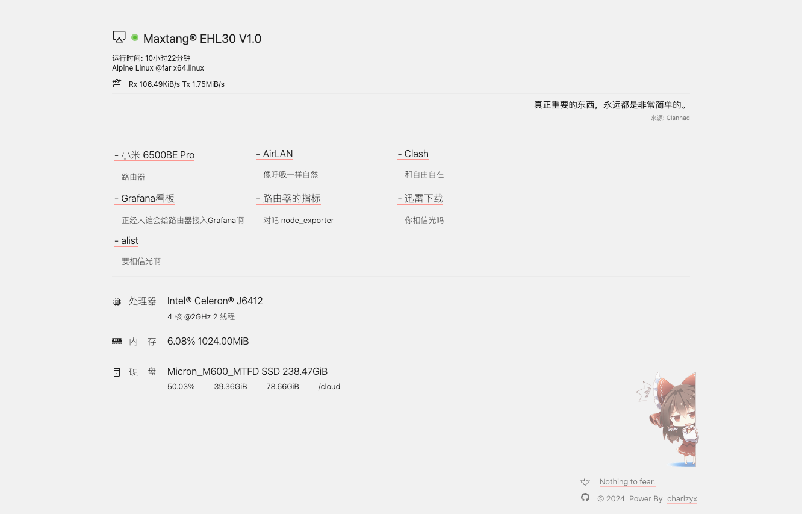

# far.

## .install

```bash
mkdir -p /opt/nv
cd /opt/nv
wget https://github.com/charlzyx/nv/releases/download/master/nv.tar.gz -O nv.tar.gz
tar -xvf nv.tar.gz
bun i --production
service nv restart
```

## .preview


